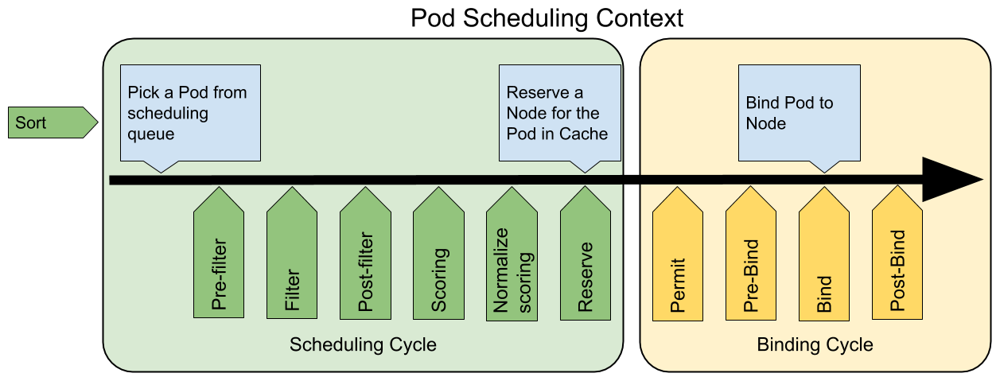
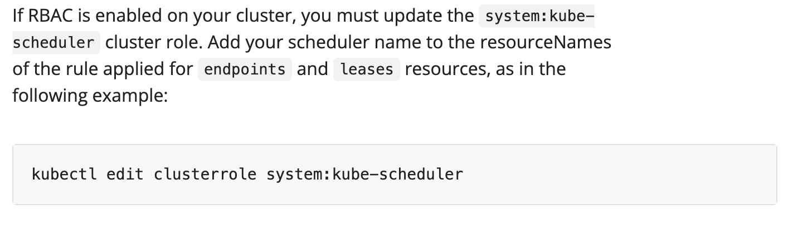

# My Sample Scheduler

An example of Kubernetes custom scheduler.



## Steps to Run

+ Build the custom scheduler image:

    ```shell
    docker build -t scheduler .
    ```

+ Apply your scheduler

    ```shell
    kubectl apply -f scheduler.yml
    ```

+ Create a pod to test

    ```shell
    kubectl apply -f test.yml
    ```

## Reference

+ <https://blog.wubw.fun/2021/12/build-kubernetes-scheduler-framework-plugin.html> Describe a good way to solve k8s dependency problems.

    > kubernetes在设计上会独立发布各个模块，并对外屏蔽部分不稳定的代码，避免主仓库作为一个整体被外部引用，所以将部分模块的依赖版本写成了v0.0.0，然后再用replace替换成了代码仓库里的相对路径，即staging目录里的独立模块。如此一来，直接使用kubernetes代码是没问题的，但是使用go get或者go mod去获取kubernetes主仓库作为依赖时会遇到诸如此类的错误：k8s.io/api@v0.0.0: reading k8s.io/api/go.mod at revision v0.0.0: unknown revision

+ Official example: https://kubernetes.io/docs/tasks/extend-kubernetes/configure-multiple-schedulers/
    
    This step matters:
    
